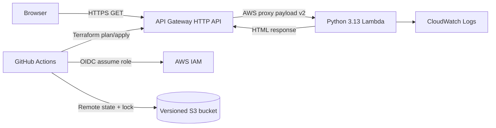

# Orbit serverless landing page

Orbit is a small, dependency-free Python landing page deployed on AWS Lambda behind an API Gateway HTTP API. Terraform owns every cloud resource, a custom module keeps the application stack reusable, and GitHub Actions tests and deploys changes using short-lived OIDC credentials.

## Architecture



There is no database, VPC, load balancer, or persistent application storage. See [Architecture decisions](docs/architecture-decisions.md) for the rationale.

## Prerequisites

- An AWS account and local AWS credentials allowed to create S3, IAM, Lambda, API Gateway, and CloudWatch resources
- Terraform 1.10 or newer
- Python 3.13 (3.10+ also works for the local unit tests)
- A GitHub repository whose default deployment branch is `main`

## 1. Test locally

```powershell
python -m unittest discover -s tests -v
powershell -NoProfile -ExecutionPolicy Bypass -File .\scripts\package.ps1
```

To preview the HTML, invoke `lambda_handler` from Python and save its `body`, or deploy the stack and use the output URL. The application uses only Python's standard library, so no dependency installation is required.

## 2. Bootstrap AWS locally (one time)

The bootstrap stack intentionally retains local state. It manages the remote-state bucket and creates a narrowly scoped GitHub Actions role using the account's existing GitHub OIDC provider.

```powershell
terraform -chdir=terraform/bootstrap init
terraform -chdir=terraform/bootstrap apply -var="github_repository=OWNER/REPOSITORY"
```

The AWS account must already have the singleton GitHub OIDC provider. This account does, and the project references it read-only rather than taking ownership of a provider shared by other repositories.

## 3. Deploy the application locally first

```powershell
$bucket = terraform -chdir=terraform/bootstrap output -raw state_bucket
$region = terraform -chdir=terraform/bootstrap output -raw aws_region
powershell -NoProfile -ExecutionPolicy Bypass -File .\scripts\package.ps1
terraform -chdir=terraform/environments/dev init -backend-config="bucket=$bucket" -backend-config="region=$region"
terraform -chdir=terraform/environments/dev plan -out=tfplan
terraform -chdir=terraform/environments/dev apply tfplan
terraform -chdir=terraform/environments/dev output -raw site_url
```

Opening the final URL should display the Orbit landing page. This first application apply writes directly to the same S3 state later used by CI, so CI takes ownership without recreating anything.

Commit the `.terraform.lock.hcl` files generated by successful initialization. They pin reviewed provider checksums across local and CI runs; Terraform state and `.terraform` working directories remain ignored.

## 4. Configure and exercise GitHub Actions

Create a GitHub environment named `dev`, restrict its deployment branch to `main`, optionally add required reviewers, and add these repository or environment variables (they are identifiers, not secrets):

```powershell
gh variable set AWS_ROLE_ARN --body "$(terraform -chdir=terraform/bootstrap output -raw github_actions_role_arn)"
gh variable set AWS_REGION --body "$(terraform -chdir=terraform/bootstrap output -raw aws_region)"
gh variable set STATE_BUCKET --body "$(terraform -chdir=terraform/bootstrap output -raw state_bucket)"
```

Push the initial code to `main`. Then change copy or styling in `app/lambda_function.py`, run the test, commit, and push to `main`. The workflow validates the code, creates a saved Terraform plan, applies exactly that plan, and publishes the URL in the job summary. Pull requests perform offline tests, formatting, and validation; they do not receive AWS credentials.

## Repository layout

```text
app/                                Lambda application
scripts/package.ps1                 Reproducible local packaging step
tests/                              Standard-library unit tests
terraform/bootstrap/                One-time state and GitHub OIDC resources
terraform/environments/dev/         Deployable root stack
terraform/modules/serverless_site/  Custom Lambda/API Gateway module
.github/workflows/terraform.yml     CI validation and CD deployment
docs/                               Decisions and operating runbook
```

## Cost and cleanup

At light demo traffic, Lambda and HTTP API usually remain within AWS free-tier allowances, but AWS billing always depends on account eligibility and usage. CloudWatch logs are retained for 14 days. To remove the application, follow the runbook; the state bucket has `prevent_destroy` to protect deployment history from accidental deletion.
