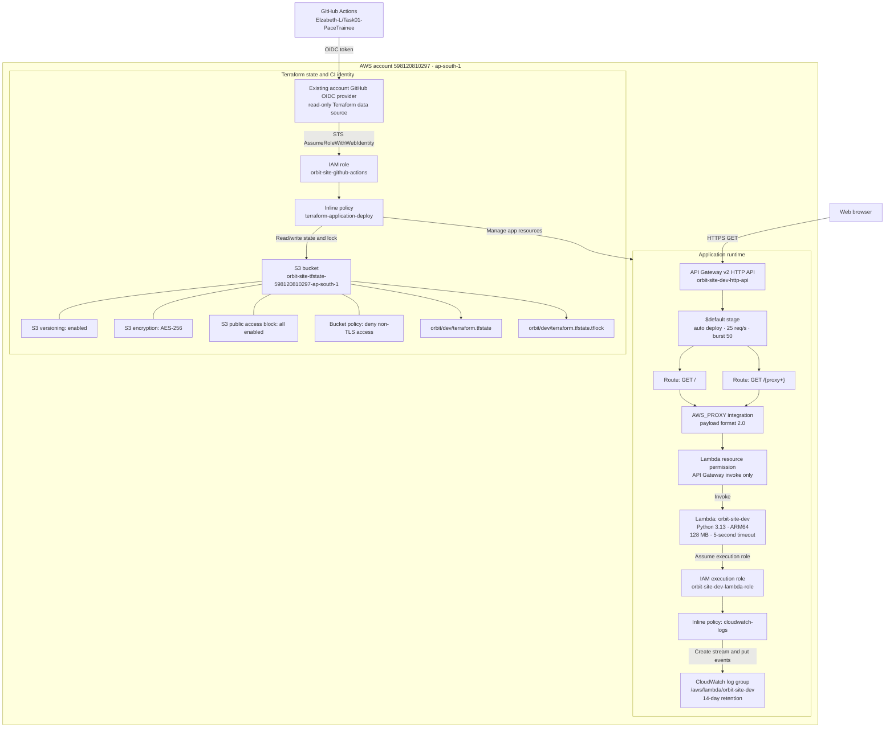
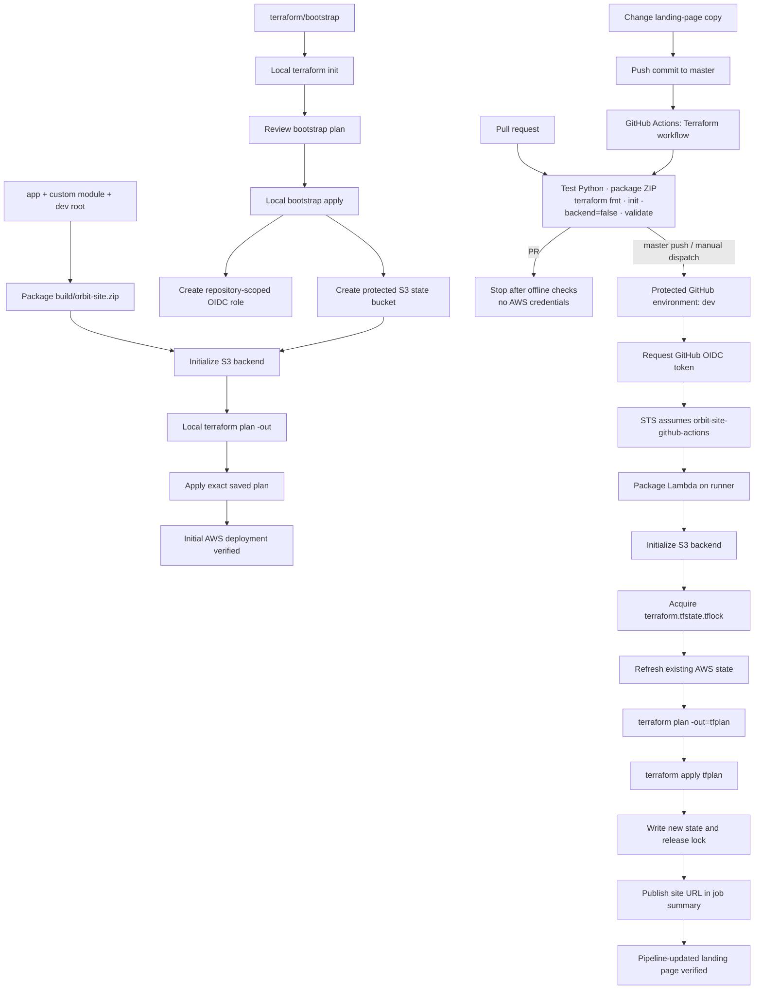

# System and workflow architecture

This document describes the AWS infrastructure, Terraform delivery workflow, and runtime behavior of the Orbit Python landing page in `ap-south-1`.

For a single standalone visual containing all three views, open [`system-architecture.svg`](system-architecture.svg).

## 1. AWS infrastructure architecture



### Complete AWS resource inventory

The project manages 17 AWS resource instances. The GitHub OIDC provider is shared account infrastructure and is deliberately read as a data source rather than managed by this project.

| Terraform address | AWS resource | Purpose |
|---|---|---|
| `aws_s3_bucket.state` | S3 bucket `orbit-site-tfstate-598120810297-ap-south-1` | Stores shared application Terraform state and native lock files. |
| `aws_s3_bucket_versioning.state` | S3 bucket versioning configuration | Preserves previous state object versions for recovery. |
| `aws_s3_bucket_server_side_encryption_configuration.state` | S3 encryption configuration | Encrypts state at rest with S3-managed AES-256 encryption. |
| `aws_s3_bucket_public_access_block.state` | S3 public access block | Blocks public ACLs and public bucket policies. |
| `aws_s3_bucket_policy.state_tls` | S3 bucket policy | Denies all S3 requests made without TLS. |
| `aws_iam_role.github_actions` | IAM role `orbit-site-github-actions` | Accepts GitHub OIDC sessions from this repository's `dev` environment. |
| `aws_iam_role_policy.github_actions` | IAM inline policy `terraform-application-deploy` | Grants scoped state, Lambda, API Gateway, Logs, and application-role permissions. |
| `module.serverless_site.aws_cloudwatch_log_group.lambda` | CloudWatch log group `/aws/lambda/orbit-site-dev` | Stores Lambda platform/application logs for 14 days. |
| `module.serverless_site.aws_iam_role.lambda` | IAM role `orbit-site-dev-lambda-role` | Runtime identity assumed only by the Lambda service. |
| `module.serverless_site.aws_iam_role_policy.lambda_logs` | IAM inline policy `cloudwatch-logs` | Allows the function to create a stream and write only to its log group. |
| `module.serverless_site.aws_lambda_function.app` | Lambda function `orbit-site-dev` | Runs `lambda_function.lambda_handler` and returns the HTML landing page. |
| `module.serverless_site.aws_apigatewayv2_api.app` | API Gateway v2 HTTP API | Provides the public HTTPS endpoint. |
| `module.serverless_site.aws_apigatewayv2_integration.lambda` | API Gateway Lambda proxy integration | Converts HTTP requests into payload-v2 Lambda events and responses back to HTTP. |
| `module.serverless_site.aws_apigatewayv2_route.root` | API route `GET /` | Routes the landing-page root request to Lambda. |
| `module.serverless_site.aws_apigatewayv2_route.proxy` | API route `GET /{proxy+}` | Routes nested GET paths to the same landing page. |
| `module.serverless_site.aws_apigatewayv2_stage.default` | API stage `$default` | Auto-deploys API changes and applies rate/burst throttling. |
| `module.serverless_site.aws_lambda_permission.api_gateway` | Lambda resource-based permission | Allows only this API Gateway execution ARN to invoke the function. |

Additional dependencies and generated objects:

- `data.aws_iam_openid_connect_provider.github` reads the account's existing `token.actions.githubusercontent.com` provider. It is not owned or destroyed by this project.
- `orbit/dev/terraform.tfstate` is the application state object generated in S3.
- `orbit/dev/terraform.tfstate.tflock` exists only while Terraform holds the native S3 state lock.
- There is no database, VPC, subnet, NAT gateway, EC2 instance, load balancer, container registry, or persistent application storage.

## 2. Terraform workflow architecture



### Workflow controls

1. **Bootstrap is local and one-time.** It solves the backend chicken-and-egg problem by creating the S3 bucket before the application tries to use it.
2. **The custom module is the deployable boundary.** `terraform/environments/dev` passes environment values and the Lambda package into `terraform/modules/serverless_site`.
3. **Source hashing drives code updates.** `filebase64sha256(app/lambda_function.py)` changes when the handler changes, causing Terraform to update Lambda without depending on platform-specific ZIP metadata.
4. **Pull requests receive no AWS identity.** They run unit tests and static Terraform validation only.
5. **Deployments use short-lived credentials.** The `dev` job requests an OIDC token and assumes `orbit-site-github-actions`; AWS keys are not stored in GitHub.
6. **Two concurrency controls prevent state races.** GitHub serializes the `terraform-dev` group, and Terraform uses the S3 `.tflock` object.
7. **Plan and apply are coupled.** CI saves `tfplan` and applies that exact file in the same protected job.

## 3. Lambda functioning

```mermaid
sequenceDiagram
    autonumber
    actor Browser
    participant API as API Gateway HTTP API
    participant Route as GET route + AWS_PROXY integration
    participant Perm as Lambda permission
    participant Fn as Python Lambda handler
    participant CW as CloudWatch Logs

    Browser->>API: HTTPS GET / or GET /path
    API->>Route: Match GET / or GET /{proxy+}
    Route->>Perm: Authorize API execution ARN
    Perm->>Fn: Invoke payload format 2.0 event
    Fn->>Fn: Read context.aws_request_id
    Fn->>Fn: HTML-escape request ID
    Fn->>Fn: Build dependency-free HTML/CSS page
    Fn-->>CW: Lambda platform START/END/REPORT logs
    Fn-->>API: statusCode 200 + headers + HTML body
    API-->>Browser: HTTP 200 text/html; charset=utf-8
```

### Handler behavior

The handler is `lambda_function.lambda_handler`:

1. API Gateway invokes it with a payload format 2.0 event and Lambda context.
2. The function reads `context.aws_request_id`, falling back to `local-preview` for local calls.
3. `_page()` escapes the request ID with Python's standard-library `html.escape` before inserting it into the footer.
4. The function constructs the complete responsive HTML and CSS in memory. It performs no network, filesystem, database, or AWS SDK calls.
5. It returns the API Gateway proxy response shape:
   - `statusCode: 200`
   - `content-type: text/html; charset=utf-8`
   - five-minute public cache control
   - `X-Content-Type-Options: nosniff`
   - a restrictive Content Security Policy
   - the generated HTML in `body`
6. API Gateway converts the response into the browser's HTTP response.

The runtime is intentionally stateless. Each invocation can execute independently, Lambda can scale concurrent instances on demand, and there is no session or user data to preserve between requests.
